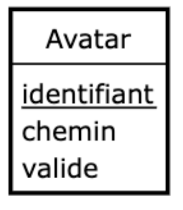

# Conception de BDD

On utilise souvent la méthodologie "Merise" pour concevoir ou documenter une base de données. Cette méthode induit 3 étapes : MCD, MLD & MPD.

Note : On peut aussi schématisé une base de données avec l'UML, mais ce n'est pas propre uniquement aux BDD.

**Ressources** : 
- `JMerise` : Logiciel officiel : https://www.jfreesoft.com/JMerise/index.php
- `Looping` : https://www.looping-mcd.fr/
- `MySQL Workbench` : https://www.mysql.com/products/workbench/

## Etape 1 : Dictionnaire des données

Il regroupe les informations que vous souhaitez stocker, dont vous vous servirez pour établir vos MCD, MLD & MPD. Ce tableau est évolutif.

Pour la première étape, vous devez renseigner les informations que vous souhaitez stocker de la sorte : 

| Table | Champs | Description |
| --- | --- | --- |
| table1 | nom | le nom de la personne |
| table1 | prenom | le prenom de la personne |

Pour rappel : 
- `Table` : Nom donné au regroupement de certains champs
- `Champs` : Nom de la donnée stockée
- `Description` : Description de la donnée stockée.

## Etape 2 : MCD Modèle Conceptuel de Données

### Entité

Correspond à une table en base de données. A pour vocation à regrouper différents champs.

Elle se représente par : 

Et un ensemble d'entités : 

### Association

Correspond aux "relations" qu'on aura entre les entités. Elle possède un **nom** (souvent on appelle ça un "verbe d'action") et éventuellement des **propriétés**. Elles peuvent être une table à terme ou non.

Elle se représente par : 

### Liaison & cardinalités

On peut "relier" les entités entre elles - via les association. On appelle ça une "liaison".
Chaque liaison dispose de cardinalités : Elles représentent le nombre d'associations possibles entre les différentes entités reliées.

Exemple d'entités + associations + liaisons + cardinalités

## Etape 3 : MLD Modèle Logique de Données

## Etape 4 : MPD Modèle Phyisique de Données