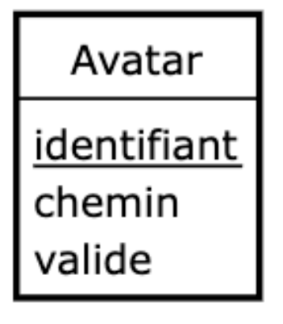
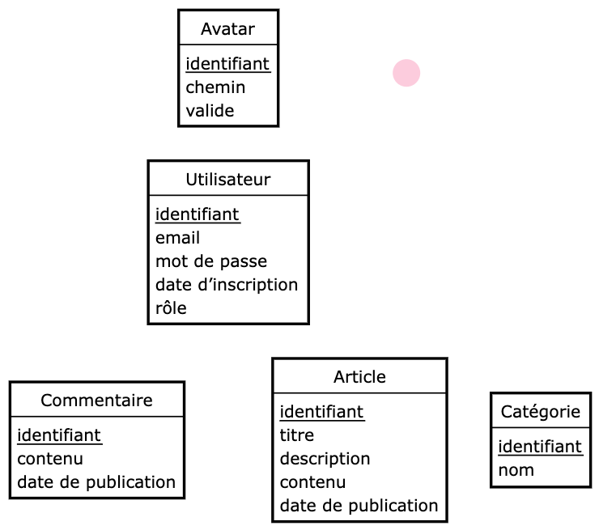
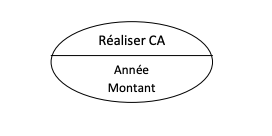
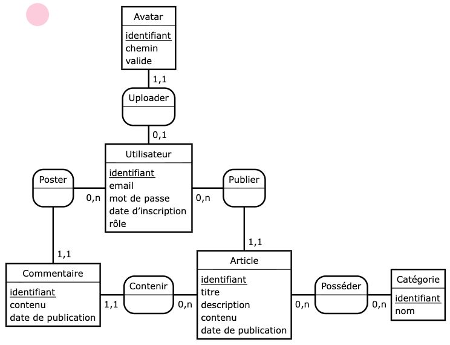

# Conception de BDD

On utilise souvent la méthodologie "Merise" pour concevoir ou documenter une base de données. Cette méthode induit 3 étapes :MCD,MLD & MPD.

Note :On peut aussi schématisé une base de données avec l'UML,mais ce n'est pas propre uniquement aux BDD.

**Ressources** :
- `JMerise` :Logiciel officiel :https://www.jfreesoft.com/JMerise/index.php
- `Looping` :https://www.looping-mcd.fr/
- `MySQL Workbench` :https://www.mysql.com/products/workbench/


## Etape 1 :Dictionnaire des données

Il regroupe les informations que vous souhaitez stocker,dont vous vous servirez pour établir vos MCD,MLD & MPD. Ce tableau est évolutif.

Pour la première étape,vous devez renseigner les informations que vous souhaitez stocker de la sorte :

| Table | Champs | Description |
| --- | --- | --- |
| table1 | nom | le nom de la personne |
| table1 | prenom | le prenom de la personne |

Pour rappel :
- `Table` :Nom donné au regroupement de certains champs
- `Champs` :Nom de la donnée stockée
- `Description` :Description de la donnée stockée.

## Etape 2 :MCD Modèle Conceptuel de Données

### Entité

Correspond à une table en base de données. A pour vocation à regrouper différents champs.

Elle se représente par :



Et un ensemble d'entités :



### Association

Correspond aux "relations" qu'on aura entre les entités. Elle possède un **nom** (souvent on appelle ça un "verbe d'action") et éventuellement des **propriétés**. Elles peuvent être une table à terme ou non.

Elle se représente par :




### Liaison & cardinalités

On peut "relier" les entités entre elles - via les association. On appelle ça une "liaison".
Chaque liaison dispose de cardinalités :Elles représentent le nombre d'associations possibles entre les différentes entités reliées.

Exemple d'entités + associations + liaisons + cardinalités



⚠️ **ATTENTION** ⚠️
Le sens de lecture peut être difficile. Voici un exemple pour s'en souvenir :

Dans l'exemple ci-dessous,il faut lire :

> un client peut avoir un ou plusieurs contrat,mais un contrat ne peut avoir que un et un seul client.


## Etape 3 :MLD Modèle Logique de Données

Le MLD (Modèle Logique de Données) est la traduction du MCD dans un format plus proche des bases de données relationnelles,tout en restant indépendant du SGBD (MySQL,PostgreSQL,etc.).

L’objectif est de déterminer les tables finales,leurs champs,et les clés (primaires et étrangères).

### Transformation du MCD en MLD

- Chaque entité du MCD devient une table.
- Chaque propriété d’une entité devient un champ de cette table.
- Les associations deviennent :
    - soit une clé étrangère (si la relation est de type 1,N ou 0,N)
    - soit une table à part entière (si la relation est de type N,N)

### Représentation au format linéaire (Modèle Linéaire de Données)

Le Modèle Linéaire de Données est une forme textuelle du MLD,utilisée pour représenter les tables,leurs champs et leurs relations de manière synthétique et lisible.

Pour chaque table,on écrit la structure sous la forme :

```
TABLE (CléPrimaire,champ1,champ2,[CléÉtrangère])
```

- La clé primaire est souvent soulignée ou écrite en majuscules.
- Les clés étrangères sont précisées entre crochets [ ].
- Les relations sont visibles grâce aux champs partagés entre les tables.

### A retenir

- Le MLD est encore théorique,il ne dépend d’aucun moteur de base de données.
- Il permet d’avoir une vision claire des tables finales avant de les implémenter.
- Il est très proche du SQL,mais reste indépendant du SGBD.

## Etape 4 :MPD Modèle Phyisique de Données

Le MPD (Modèle Physique de Données) est la dernière étape de la conception d’une base de données.

C’est la traduction technique et concrète du MLD dans le langage du SGBD choisi (MySQL,PostgreSQL,SQLite,etc.).

Autrement dit,c’est à ce stade que les tables,les types de champs et les contraintes sont définis précisément,prêtes à être créées en SQL.

L’objectif du MPD est de préparer la base de données réelle qui sera utilisée par votre application.
Il précise notamment :

- Le nom des tables et des champs
- Le type des données (texte,nombre,date…)
- Les clés primaires et étrangères
- Les contraintes d’intégrité (NOT NULL,UNIQUE,DEFAULT,etc.)
- Les index éventuels pour optimiser les recherches

### Exemple 

**MLD**

```
CLIENT (id_client,nom,prenom)
CONTRAT (id_contrat,date,montant,[id_client])
```

**MPD**

```sql
CREATE TABLE Client (
    id_client INT AUTO_INCREMENT PRIMARY KEY,
    nom VARCHAR(100) NOT NULL,
    prenom VARCHAR(100) NOT NULL
);

CREATE TABLE Contrat (
    id_contrat INT AUTO_INCREMENT PRIMARY KEY,
    date DATE NOT NULL,
    montant DECIMAL(10,2) NOT NULL,
    id_client INT NOT NULL,
    FOREIGN KEY (id_client) REFERENCES Client(id_client)
);
```

Pour la réalisation du MPD,je vous recommande MySQL Workbench 😇


# TP Conception
1. Faire le MCD et me l'envoyer par MP dès qu'il est prêt.
2. Faire le MLD et me l'envoyer par MP dès qu'il est prêt.
3. Faire le MPD et me l'envoyer par MP dès qu'il est prêt.
4. L'exécution de votre script issu du MPD doit être fonctionnel et non bugué !