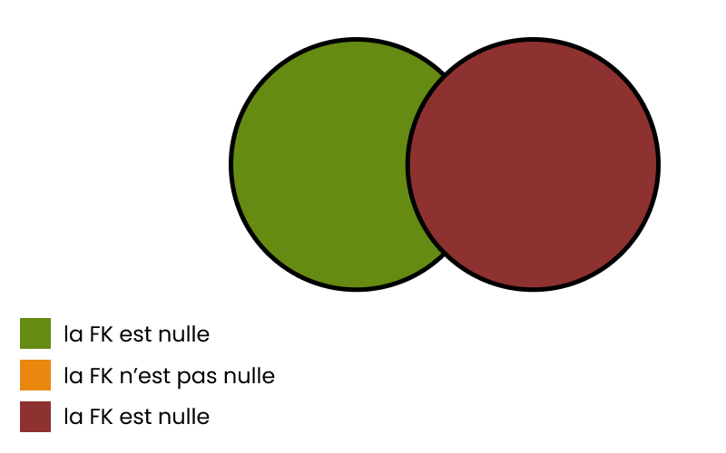
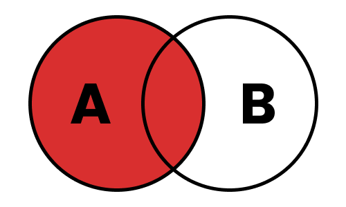
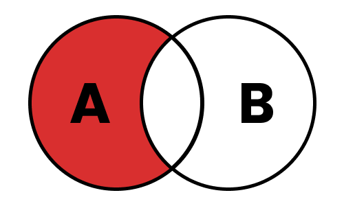
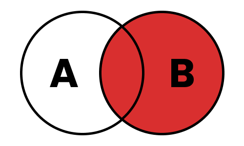
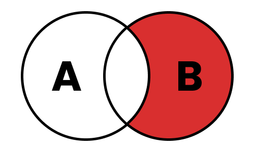
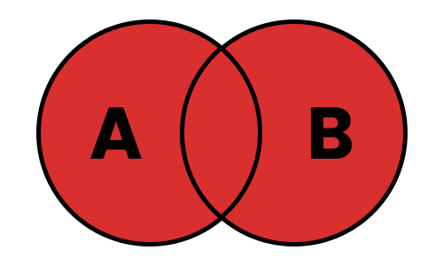
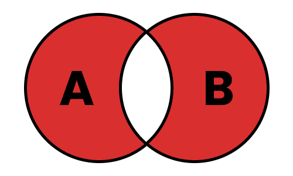
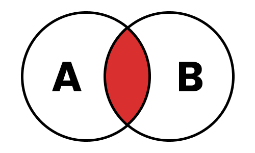

# MDS-2526-B3-DW-SQL

## Liens utiles

- `https://sql.sh` : cours global pour les requêtes
- `https://github.com/Microleadoff/database-installer-py` : lien de l'installateur des 4 BDD en python
- `https://cartman34.fr/wp-content/uploads/2017/01/sql_joins.jpg`, `https://miro.medium.com/v2/0*bkfApXMFeO1E7Pom.png` : images sur les jointures

### Ordre des mots-clés dans une requête

```sql
SELECT *
FROM table
WHERE condition
GROUP BY expression
HAVING condition
{ UNION | INTERSECT | EXCEPT }
ORDER BY expression
LIMIT count
OFFSET start
```

### Description des instructions

- `SELECT DISCINCT` : supprime les doublons
- `WHERE` : permet de poser une condition - filtrer les résultats. Les opérateurs possibles utilisables avec la clause WHERE :

| Opérateur  | Description                                                       |
|------------|-------------------------------------------------------------------|
| =          | Égale                                                             |
| <>         | Pas égale                                                         |
| !=         | Pas égale                                                         |
| >          | Supérieur à                                                       |
| <          | Inférieur à                                                       |
| >=         | Supérieur ou égale à                                              |
| <=         | Inférieur ou égale à                                              |
| IN         | Liste de plusieurs valeurs possibles                              |
| BETWEEN    | Valeur comprise dans un intervalle donnée (utile pour les nombres ou dates) |
| LIKE       | Recherche en spécifiant le début, milieu ou fin d'un mot          |
| IS NULL    | Valeur est nulle                                                  |
| IS NOT NULL| Valeur n'est pas nulle                                            |

-  `WHERE ... AND ...` : Permet d'ajouter plusieurs conditions 
-  `WHERE ... OR ...` : Permet d'ajouter plusieurs conditions optionnelles
-  `WHERE ... IN ...` : Permet de filtrer sur une liste d'éléments
-  `WHERE ... BETWEEN ...` : Permet de filtrer entre 2 valeurs
-  `WHERE ... IS NULL ...` : Permet de filtrer sur les champs "NULL"
-  `WHERE ... LIKE ...` : Permet de filtrer sur les chaines de caractères. Voici les utilisations possibles

| Modèle        | Description                                                                 | Exemples correspondants       |
|---------------|-----------------------------------------------------------------------------|--------------------------------|
| `LIKE '%a'`   | Recherche toutes les chaînes qui **se terminent par “a”**                   | `pizza`, `salsa`              |
| `LIKE 'a%'`   | Recherche toutes les chaînes qui **commencent par “a”**                     | `avion`, `arbre`              |
| `LIKE '%a%'`  | Recherche toutes les chaînes qui **contiennent “a”**                        | `chat`, `manger`              |
| `LIKE 'pa%on'`| Recherche les chaînes qui **commencent par “pa” et se terminent par “on”**  | `pantalon`, `pardon`          |
| `LIKE 'a_c'`  | Le caractère `_` représente **un seul caractère** (contrairement à `%`)     | `aac`, `abc`, `azc`           |


## Exemples de requetes pour pratique sur la BDD WORLD

- `SELECT DISTINCT state_code FROM cities;` (1185)
- `SELECT * FROM cities WHERE state_code = "07";` (435)
- `SELECT * FROM cities WHERE state_code = "07" AND country_code = "AD";` (0)
- `SELECT * FROM cities WHERE state_code = "07" OR country_code = "AD";` (444)
- `SELECT * FROM cities WHERE latitude > 42 AND longitude > 1.5;` (53085)
- `SELECT * FROM cities WHERE latitude < 20 AND longitude > 50;` (15814)
- `SELECT * FROM cities WHERE latitude > 42 AND longitude > 1.5 OR latitude < 20 AND longitude > 50;` (68899)
- `SELECT * FROM cities WHERE (latitude > 42 AND longitude > 1.5) OR (latitude < 20 AND longitude > 50);` (68899)
- `SELECT * FROM cities WHERE country_code IN ("AD", "AE");` (49)
- `SELECT * FROM cities WHERE latitude BETWEEN 20 AND 30;` (10235)
- `SELECT * FROM countries WHERE wikiDataId IS NULL;` (47)
- `SELECT * FROM countries WHERE wikiDataId IS NOT NULL;` (203)
- `SELECT * FROM cities WHERE name LIKE 'a%';` (9002)
- `SELECT * FROM cities WHERE name LIKE '%a';` (25624)
- `SELECT * FROM cities WHERE name LIKE '%zw%';` (76)
- `SELECT * FROM cities WHERE name LIKE '%c_t%';` (1973)

## Explication des jointures

### Généralités 

- Permet de récupérer des données reliées entre plusieurs tables
- Comment savoir quelle table est à gauche ou à droite : la première indiquée est écrite à gauche de l'autre : c'est donc la table de gauche
- 4 types de jointure différents
    - LEFT : récupère les informations de la table de gauche, et les lie avec la table de droite
    - RIGHT : récupère les informations de la table de droite, et les lie avec la table de gauche
    - INNER : récupère les informations des tables de gauche ET de droite, dont la FK n'est pas nulle
    - OUTER : récupère les informations des tables de gauche et de droite

Quelques rappels **SIMPLES** pour la gestion des foreign keys dans les relations : 



### LEFT INCLUSIVE



Récupère toutes les lignes de la table de gauche, ainsi que les lignes de la table de droite dont la Foreign Key n'est pas nulle

Exemple de requête générique : 

```SQL
SELECT [LIST] FROM TableA as A LEFT JOIN TableB as B ON A.Foreignkey = B.Foreignkey;
```

Exemple de requête dans la BDD World : 

```SQL
-- SELECT * FROM cities as ci LEFT JOIN countries as c ON ci.country_id = c.id;
```

### LEFT EXCLUSIVE



Récupère toutes les lignes de la table de gauche, dont la Foreign Key de la table de droite est nulle.

Exemple de requête générique : 

```SQL
SELECT [LIST] FROM TableA as A LEFT JOIN TableB as B ON A.Foreignkey = B.Foreignkey WHERE B.Foreignkey IS NULL;
```

Exemple de requête dans la BDD World : 

```SQL
-- SELECT * FROM cities as ci LEFT JOIN countries as c ON ci.country_id = c.id WHERE c.id IS NULL;
```

### RIGHT INCLUSIVE



Récupère toutes les lignes de la table de droite, ainsi que les lignes de la table de gauche dont la Foreign Key n'est pas nulle

Exemple de requête générique : 

```SQL
SELECT [LIST] FROM TableA as A RIGHT JOIN TableB as B ON A.Foreignkey = B.Foreignkey;
```

Exemple de requête dans la BDD World : 

```SQL
-- SELECT * FROM cities as ci RIGHT JOIN countries as c ON ci.country_id = c.id;
```

### RIGHT EXCLUSIVE



Récupère toutes les lignes de la table de droite, dont la Foreign Key de la table de gauche est nulle.

Exemple de requête générique : 

```SQL
SELECT [LIST] FROM TableA as A RIGHT JOIN TableB as B ON A.Foreignkey = B.Foreignkey WHERE A.Foreignkey IS NULL;
```

Exemple de requête dans la BDD World : 

```SQL
-- SELECT * FROM cities as ci RIGHT JOIN countries as c ON ci.country_id = c.id WHERE ci.country_id IS NULL;
```

### FULL OUTER INCLUSIVE



Récupère toutes les lignes des tables de droite et de gauche.

Exemple de requête générique : 

```SQL
SELECT [LIST] FROM TableA as A FULL OUTER JOIN TableB as B ON A.Foreignkey = B.Foreignkey;
```

Exemple de requête dans la BDD World : 

```SQL
-- SELECT * FROM cities as ci RIGHT JOIN countries as c ON ci.country_id = c.id WHERE ci.country_id IS NULL;
```

### FULL OUTER EXCLUSIVE



Récupère toutes les lignes des tables de droite et de gauche, dont la Foreign Key de la table de gauche n'est pas nulle.

Exemple de requête générique : 

```SQL
SELECT [LIST] FROM TableA as A FULL OUTER JOIN TableB as B ON A.Foreignkey = B.Foreignkey WHERE A.Foreignkey IS NULL OR B.Foreignkey IS NULL;
```

Exemple de requête dans la BDD World : 

```SQL
-- SELECT * FROM cities as ci RIGHT JOIN countries as c ON ci.country_id = c.id WHERE ci.country_id IS NULL;
```

### INNER



Récupère toutes les lignes des tables de droite et de gauche, dont la Foreign Key entre les deux tables n'est pas nulle.

Exemple de requête générique : 

```SQL
SELECT [LIST] FROM TableA as A INNER JOIN TableB as B ON A.Foreignkey = B.Foreignkey;
```

Exemple de requête dans la BDD World : 

```SQL
-- SELECT * FROM cities as ci RIGHT JOIN countries as c ON ci.country_id = c.id WHERE ci.country_id IS NULL;
```


## Explication des contraintes

- C'est une règle qui concerne une ou plusieurs colonne(s). Elle existe souvent quand on a une clé étrangère.
- On peut en avoir autant qu'on le souhaite
- Elle a 3 propriétés : 
    - Un nom pour l'identifier.
    - `ON DELETE` : l'action effectuée lors de la suppression d'une ligne concernée par la contrainte
    - `ON UPDATE` : l'action effectuée lors de la modification d'une ligne concernée par la contrainte

Il existe 4 possibilités de traitement pour les `ON UPDATE` & `ON DELETE` : 
- `CASCADE` : lors d’un `UPDATE` de la clé primaire, la valeur est répercutée dans toutes les clés étrangères correspondantes ; lors d’un `DELETE`, toutes les lignes enfants référencées sont supprimées.
- `SET NULL` : lors d’un `UPDATE` ou d’un `DELETE`, les colonnes de clé étrangère des lignes enfants sont remplacées par `NULL` (si elles l’acceptent).
- `RESTRICT` : blocage instantané.
- `NO ACTION` : blocage seulement à la validation de la transaction.


## TP 1

En individuel, vous allez devoir continuer, ce fichier readme : 

- Vous créez votre propre fichier, a part
- Vous traitez un maximum de cas de figure sur le site sql.sh
- Vous ne faites ni de jointure, ni de procédures stockées, ni de trigger

Vous allez devoir pour chaque instruction que l'on n'a pas vu : 

1. expliquer l'instruction rapidement
2. en vous servant de la base de données "SAKILA", vous allez créer 1 à 3 cas defigure nécessitants une requete. Par exemple :"Récupérer tous les state_code de la table cities sans aucun doublon". Vous devrez ensuite écrire la requete SQL correspondante, par exemple : `SELECT DISTINCT state_code FROM cities;`. Notez le nombre de résultats obtenus par exemple (1185).


## TP 2

Refaire les requêtes dans la BDD World (des requêtes qui font sens !) pour qu'on les intègre dans le cours
Idem que TP1, mais sur les jointures. (BDD SAKILA)


```SQL

SELECT * FROM A INNER JOIN B ON A.key = B.key
SELECT * FROM B OUTER JOIN A ON A.key = B.key
SELECT * FROM B LEFT JOIN A ON A.key = B.key
SELECT * FROM A RIGHT JOIN B ON A.key = B.key


```